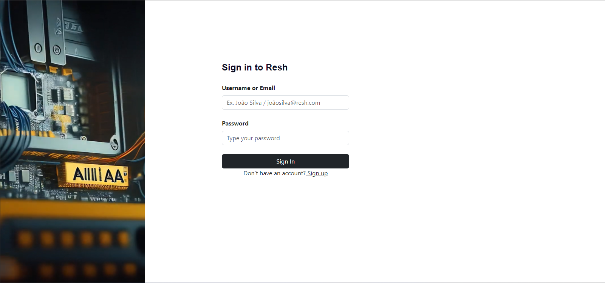
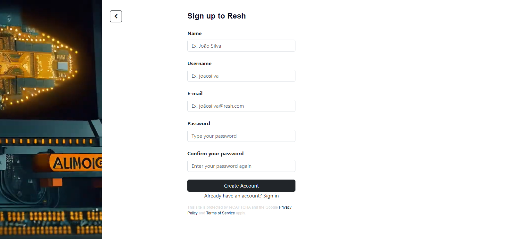
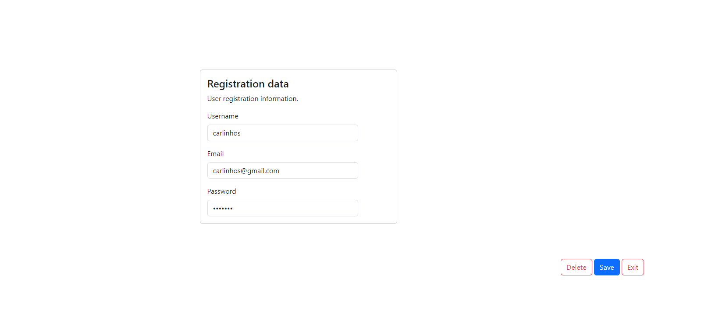

# Technical Challenge - Resh

## Description

Resh Cyber Defense gave me a technical challenge for a vacancy I'm participating in,
and that challenge is to create a simple application using Django.

## Challenge requirements

  - Create an account
  - Log in
  - To go out
  - Change email or password
  - Delete account

## Demostration






## Starting

To run the project, you need to install the following programs:

- [Python: Obrigatorio para criar o projeto](https://www.python.org/downloads/)
- [VS Code: Obrigatorio para desenvolver o projeto](https://code.visualstudio.com/)

## ⌨️ Developing

Use Gitpod, a free online development environment for GitHub.

[](https://gitpod.io/#https://github.com/Suspir0n/resh.git)

Or use the code locally using:
```
$ cd "directory of your choice"
$ git clone https://github.com/Suspir0n/resh.git
```

### Building

To build a Django application, run the commands below:

```
$ pip install -r requirements.txt
```

These are the dependencies within requirements.txt:

```
asgiref==3.7.2
Django==4.2.1
python-dotenv==1.0.0
sqlparse==0.4.4
tzdata==2023.3
```

Make these settings so that your Django application works perfectly.

## Run Tests with coverage

````
coverage report
```` 

````
Name                    Stmts   Miss  Cover
-------------------------------------------
accounts\__init__.py        0      0   100%
accounts\admin.py           6      0   100%
accounts\apps.py            4      0   100%
accounts\backends.py       14      0   100%
accounts\forms.py          17      0   100%
accounts\models.py         31      0   100%
accounts\tests.py           1      0   100%
accounts\urls.py            3      0   100%
accounts\views.py          42      1    98%
dashboard\__init__.py       0      0   100%
dashboard\admin.py          1      0   100%
dashboard\apps.py           4      0   100%
dashboard\models.py         1      0   100%
dashboard\tests.py          1      0   100%
dashboard\urls.py           3      0   100%
dashboard\views.py         23      0   100%
setup\__init__.py           0      0   100%
setup\settings.py          26      0   100%
setup\urls.py               3      0   100%
-------------------------------------------
TOTAL                     180      1    99%
````

## Configuration

To execute the project, it is necessary to use VsCode or an IDE of your preference, so that it identifies the dependencies necessary for execution in the repository. Once the project is imported, it will be possible to test its functionality in real time.

## Contributions

Contributions are always welcome! I hope I have helped someone in need.

## 🔓 License
MIT © [Evandro Silva](https://www.linkedin.com/in/suspir0n/)